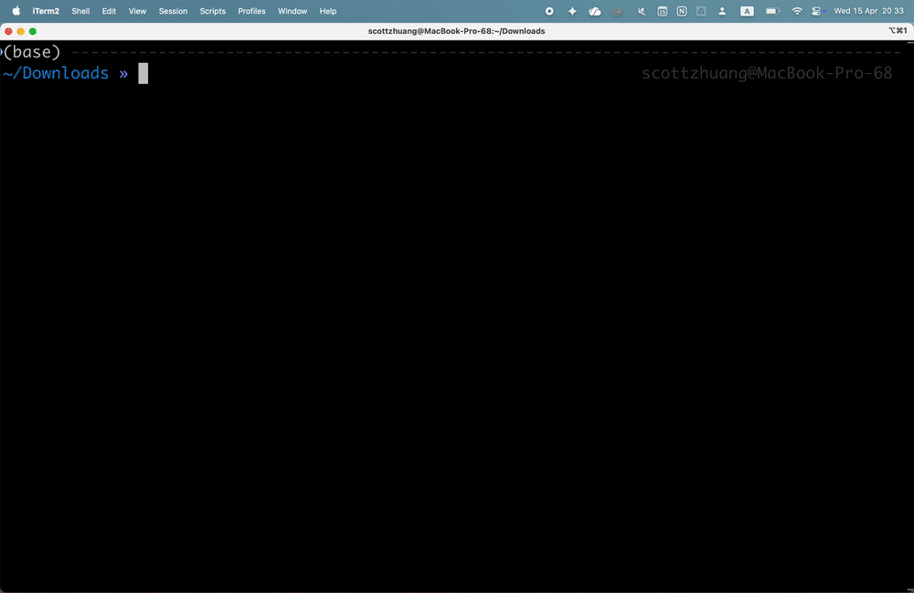

# VMD SDF Loader plugin

This repository adds SDF support to VMD in two modes:

- `Structure Data File SDF (trajectory)`:
  Loads one SDF record as the topology and treats later compatible records as trajectory frames.
- `sdfload` / `Load SDF As Molecules`:
  Loads each SDF record as a separate VMD molecule.

The Tcl loader is the portable/default path. The compiled molfile plugin under `molfile/` is optional and is only needed for the explicit `SDF (trajectory)` file type.

For supported macOS and Linux targets, you can download a prebuilt bundle from the GitHub Releases page instead of building locally. An experimental Windows bundle is also built in CI, but it has not been runtime-tested with VMD; see [Windows Notes](#windows-notes).



## 1. Add It To `~/.vmdrc`

To make VMD see the Tcl loader at startup, add this to `~/.vmdrc`:

```tcl
source /absolute/path/to/vmd_sdf_plugin/sdfloader1.0/sdfloader.tcl
```

This is enough for:

- `sdfload file.sdf`
- `sdftrajload file.sdf`
- `mol new file.sdf`
- `molecule new file.sdf`
- `Extensions -> Data -> Load SDF`

Adding the compiled `molfile/` plugin directory is optional. Only add this if you also want:

- `File -> New Molecule -> Structure Data File SDF (trajectory)`
- `mol new file.sdf type SDF`
- `molecule new file.sdf type {Structure Data File SDF (trajectory)}`

```tcl
set sdfplugin_dir /absolute/path/to/vmd_sdf_plugin/molfile
if {[llength [info commands vmd_plugin_scandirectory]] && [file isdirectory $sdfplugin_dir]} {
    catch {vmd_plugin_scandirectory $sdfplugin_dir *.so}
}
unset -nocomplain sdfplugin_dir

```

**This compiled plugin path is not currently supported with VMD 2 on macOS.**
For Windows, see [Windows Notes](#windows-notes).

Restart VMD after changing `~/.vmdrc`.

If you start VMD directly with an SDF file, for example `vmd example.sdf`, the initial built-in SDF load may still print a Babel-related error before `~/.vmdrc` is sourced. Once `sdfloader.tcl` loads, it recovers the startup import and, by default, uses split-record mode so each SDF record becomes a separate VMD molecule.

## 2. Use It With The GUI

### Multiple-Molecule Mode

Use this when one SDF file contains many ligands and you want one VMD molecule per record.

Requires: `sdfloader.tcl` only. The compiled `.so` is not required.

GUI:

- `Extensions -> Data -> Load SDF As Molecules`

### Trajectory Mode

Use this when you want one VMD molecule.

Tcl GUI path:

Requires: `sdfloader.tcl` only. The compiled plugin is not required.

- `Extensions -> Data -> Load SDF As Trajectory`

This path will:

- load the first record as structure
- load later records as frames only if atom sequence and bond topology match
- skip incompatible records

Compiled molfile path:

Requires: the compiled molfile plugin under `molfile/`.

- `File -> New Molecule -> Structure Data File SDF (trajectory)`

This path also will:

- load the first record as structure
- load later records as frames only if atom sequence and bond topology match
- skip incompatible records

Equivalent console commands:

```tcl
molecule new file.sdf type {Structure Data File SDF (trajectory)} waitfor all
```

or:

```tcl
mol new file.sdf type SDF waitfor all
```

## 3. Use It With Tcl

### Load Every SDF Record As A Separate Molecule

Requires: `sdfloader.tcl` only. The compiled `.so` is not required.

```tcl
set molids [sdfload file.sdf]
```

This returns a list of VMD molecule ids.

Because the Tcl wrapper is installed, these also default to multi-molecule loading:

```tcl
mol new file.sdf
molecule new file.sdf
```

### Force Trajectory Mode

Requires: `sdfloader.tcl` only. The compiled `.so` is not required.

```tcl
set molid [sdfload -mode trajectory file.sdf]
```

or:

```tcl
set molid [sdftrajload file.sdf]
```

### Explicit Trajectory Load Through The Molfile Plugin

Requires: the compiled molfile plugin under `molfile/`.

```tcl
mol new file.sdf type SDF waitfor all
```

or:

```tcl
molecule new file.sdf type {Structure Data File SDF (trajectory)} waitfor all
```

## Additional Notes

The project uses two pieces:

- [src/sdfplugin.cpp](src/sdfplugin.cpp): a compiled molfile plugin for the single-molecule / trajectory path
- [sdfloader1.0/sdfloader.tcl](sdfloader1.0/sdfloader.tcl): a Tcl loader for multi-record split loading


### Build

You do not need to run `make` if the compiled plugin already exists for your machine and VMD build.

Build only if needed:

- the compiled plugin file is missing
- you changed [src/sdfplugin.cpp](src/sdfplugin.cpp)
- you are moving to a different OS / architecture / VMD build

Build command:

```sh
make
```

The build now uses the vendored VMD plugin headers in [include](include), so GitHub Actions and local Linux/macOS builds do not depend on a hardcoded VMD app path. For the experimental Windows CI path, see [Windows Notes](#windows-notes).

This creates:

```text
molfile/sdfplugin.so
```

To package a runtime bundle like the release assets:

```sh
make package PACKAGE_VERSION=dev
```

This creates a release archive under `dist/`:

- Linux/macOS: `.tar.gz`

For the experimental Windows CI bundle format, see [Windows Notes](#windows-notes).

### GitHub Actions / Releases

GitHub Actions now builds the plugin on:

- Linux
- macOS

CI runs on every push and pull request through [.github/workflows/ci.yml](.github/workflows/ci.yml) and uploads per-platform release bundles as workflow artifacts. An experimental Windows bundle is also built there; see [Windows Notes](#windows-notes).

Tagged releases are handled by [.github/workflows/release.yml](.github/workflows/release.yml):

- create and push a tag like `v1.0.0`
- GitHub Actions builds the Linux and macOS bundles
- the workflow creates or updates the matching GitHub Release
- the release assets include those bundles and `SHA256SUMS.txt`

For supported Linux and macOS targets, users can install from the release bundles without running `make`. For the experimental Windows bundle, see [Windows Notes](#windows-notes).

### macOS Gatekeeper

If you download the macOS release bundle, macOS may warn when VMD tries to load `sdfplugin.so`, for example:

```text
Apple could not verify “sdfplugin.so” is free of malware that may harm your Mac or compromise your privacy.
```

If that happens:

1. Try loading the plugin once so macOS records the blocked item.
2. Open `System Settings -> Privacy & Security`.
3. In the Security section, find the message about `sdfplugin.so`.
4. Click `Allow Anyway`.
5. Retry launching VMD or reloading the plugin.

### VMD 2 On macOS

VMD 2 on macOS is not currently supported for the compiled `molfile/sdfplugin.so` plugin. Newer macOS code-signing and library-validation rules can prevent VMD 2 from loading an external `.so` even when `Allow Anyway` is used.

On macOS with VMD 2, use the Tcl loader directly instead:

```tcl
source /absolute/path/to/vmd_sdf_plugin/sdfloader1.0/sdfloader.tcl
set molids [sdfload file.sdf]
```

or:

```tcl
source /absolute/path/to/vmd_sdf_plugin/sdfloader1.0/sdfloader.tcl
mol new file.sdf
```

The Tcl loader path remains supported there; the limitation is specifically the compiled external `.so` plugin.

### Caveat / Limitation

`File -> New Molecule` cannot create multiple VMD molecules from one file through the molfile plugin API.

That is a VMD limitation, not an SDF parsing limitation. The molfile interface is designed for:

- one molecule
- optional multiple frames

So:

- use `File -> New Molecule` for trajectory-style SDF loading
- use `sdfload` or `Extensions -> Data -> Load SDF As Molecules` for split-record loading

### Test Files

Example SDFs are documented in [examples/README.md](examples/README.md).

Quick checks:

Compiled trajectory plugin:

```tcl
mol new examples/multi_ligands_frames.sdf type SDF
```

and

Tcl split-record loader:

```tcl
set molids [sdfload examples/multi_ligands_mixed.sdf]
```

### Notes

- The multi-molecule Tcl path uses TopoTools inside VMD.
- V2000 SDF is supported.
- Common V3000 atom and bond blocks are supported.
- SD properties such as Open Babel `atom.dprop.PartialCharge` are used to populate per-atom partial charges when present.
- Bond orders are loaded from the SDF records instead of relying only on VMD bond guessing.

### Windows Notes

Windows support is currently experimental and has not been runtime-tested with VMD.

- GitHub Actions builds a Windows bundle in addition to the Linux/macOS bundles.
- The Windows bundle contains `molfile/sdfplugin.dll` instead of `molfile/sdfplugin.so`.
- The Windows release artifact is packaged as a `.zip` instead of a `.tar.gz`.
- If you want VMD to scan the compiled plugin directory on Windows, use `vmd_plugin_scandirectory $sdfplugin_dir *.dll`.
- If the compiled plugin path does not work on your Windows VMD build, use `sdfloader.tcl` directly.

### License

The original code in this repository is licensed under the MIT License in [LICENSE](LICENSE).

Vendored VMD plugin headers in [include](include) retain their original UIUC Open Source License terms. See [THIRD_PARTY_NOTICES.md](THIRD_PARTY_NOTICES.md) and [LICENSES/UIUC-Open-Source-License.txt](LICENSES/UIUC-Open-Source-License.txt).

### AI Disclosure

Most of this project, including code, documentation, and CI/release workflow changes, was developed with substantial assistance from OpenAI Codex / ChatGPT (GPT-5-class models).

The generated work should be treated as maintainer-curated source and reviewed accordingly.
